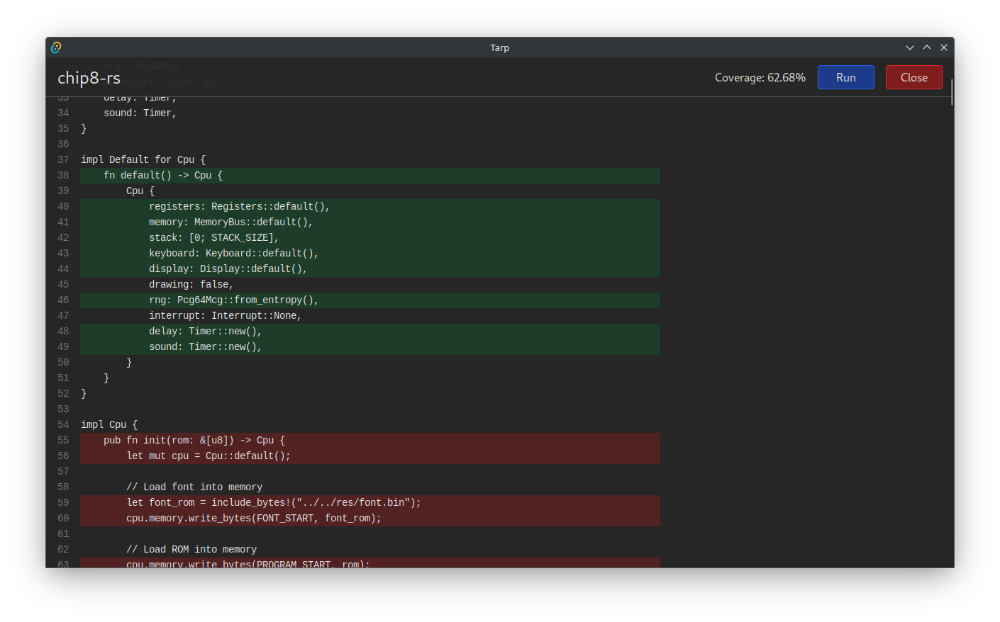

# Tarp


Simple code coverage visualization tool for [tarpaulin](https://github.com/xd009642/tarpaulin)



## Installation

Packages for Windows, macOS, and Linux are available on the [releases page](https://github.com/mrivnak/tarp/releases).

## Building from source

### Prerequisites

- [Rust](https://www.rust-lang.org/tools/install)
- [Node.js](https://nodejs.org/en/download/)
- [PNPM](https://pnpm.io/installation)
- [Tauri prerequisites](https://tauri.app/v1/guides/getting-started/prerequisites)

```bash
pnpm install

# on Linux, Windows, and macOS
pnpm tauri build
# some Linux distributions fail to strip libwebkit2gtk so you can disable it
NO_STRIP=true pnpm tauri build
```

The resulting .exe/.dmg/.deb/.AppImage will be in the `src-tauri/target/release/bundle/` directory.
